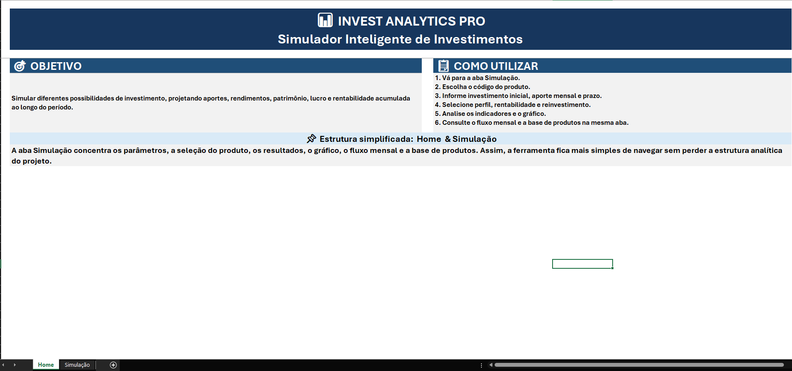
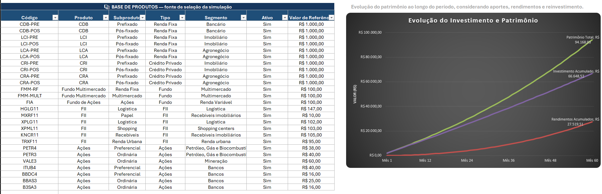
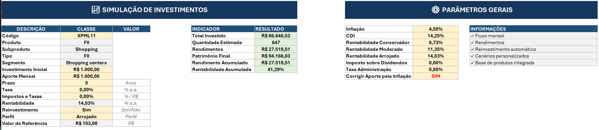

# 📊 INVEST ANALYTICS PRO

## Simulador Inteligente de Investimentos


Ferramenta desenvolvida em **Microsoft Excel** para simulação e análise de diferentes cenários de investimento, permitindo projetar aportes, rendimentos e patrimônio ao longo do tempo.

Projeto desenvolvido como parte do desafio da formação **Análise de Dados com Excel e IA da DIO**.

> **Projeto de caráter educacional. As projeções apresentadas dependem das premissas utilizadas na simulação e não representam recomendação ou garantia de rentabilidade.**

---

## 🎯 Sobre o projeto

O **INVEST ANALYTICS PRO** foi desenvolvido com o objetivo de transformar parâmetros de investimento em uma simulação estruturada, permitindo acompanhar a evolução financeira de um cenário ao longo do tempo.

A ferramenta combina **organização de dados, fórmulas, validações, cálculos financeiros e visualização gráfica** em uma interface simplificada.

A proposta é facilitar a análise de diferentes cenários a partir de informações como investimento inicial, aportes mensais, prazo, rentabilidade, reinvestimento e inflação.

---

## 💡 Principais funcionalidades

- 💰 Definição de investimento inicial;
- 📅 Configuração de aportes mensais;
- ⏳ Definição do prazo da simulação;
- 📈 Aplicação de premissas de rentabilidade;
- 👤 Seleção de perfil de investidor;
- 🔄 Simulação de reinvestimento dos rendimentos;
- 📊 Correção dos aportes pela inflação;
- 📅 Projeção financeira mês a mês;
- 💵 Cálculo do total investido;
- 📈 Cálculo dos rendimentos acumulados;
- 🏦 Projeção do patrimônio final;
- 📊 Visualização gráfica da evolução do investimento.

A base da ferramenta contempla diferentes tipos de investimentos, permitindo trabalhar com cenários envolvendo produtos como **CDB, LCI, LCA, CRI, CRA, fundos, Fundos Imobiliários e ações**.

---

## 🏗️ Estrutura da ferramenta

A versão final foi organizada em **duas abas**:

### 🏠 Home

Área de apresentação da ferramenta, contendo:

- identidade do projeto;
- objetivo;
- orientações de utilização;
- visão geral da solução.



### 📈 Simulação

Área principal da ferramenta, onde estão concentrados:

- parâmetros de entrada;
- seleção do produto;
- cálculos;
- indicadores;
- fluxo mensal;
- gráfico de evolução.

A concentração dos recursos em duas abas foi adotada para tornar a utilização mais simples, direta e intuitiva.

---

## 🎥 Demonstração da ferramenta

### 📋 Base de produtos e análise da evolução

A ferramenta utiliza uma base estruturada de produtos de investimento como fonte para a seleção e configuração dos cenários de simulação.

A mesma estrutura permite relacionar os produtos às projeções financeiras e visualizar graficamente a evolução do investimento ao longo do período analisado.



A visualização apresenta a evolução de:

- **Patrimônio Total**;
- **Investimento Acumulado**;
- **Rendimentos Acumulados**.

O gráfico permite observar como os aportes e os rendimentos contribuem para a formação do patrimônio projetado ao longo dos meses.

---


## 📊 Indicadores

A ferramenta apresenta uma visão consolidada dos principais resultados da simulação:

| Indicador | Finalidade |
|---|---|
| **Total Investido** | Valor destinado ao investimento durante o período |
| **Rendimentos** | Rendimentos acumulados na simulação |
| **Patrimônio Final** | Patrimônio projetado ao final do período |
| **Lucro** | Resultado obtido em relação ao capital investido |
| **Rentabilidade** | Resultado acumulado em termos percentuais |

Além dos indicadores, o fluxo mensal permite acompanhar a evolução da simulação ao longo do período projetado.

---

## 📈 Visualização

O gráfico permite acompanhar a evolução de três componentes:

- **Patrimônio Total**
- **Investido Acumulado**
- **Rendimentos Acumulados**

A visualização facilita a interpretação da relação entre o capital investido, os rendimentos gerados e o patrimônio projetado.



---

## 🛠️ Tecnologias e recursos

### Microsoft Excel

Recursos utilizados no desenvolvimento:

- Fórmulas e funções;
- Validação de dados;
- Busca e relacionamento de informações;
- Cálculos financeiros;
- Projeção mensal;
- Tabelas;
- Indicadores;
- Gráficos;
- Organização de interface.

O **GitHub** foi utilizado para publicação, documentação e versionamento do projeto.

---

## 📚 Aprendizados

O desenvolvimento do INVEST ANALYTICS PRO permitiu aplicar, de forma prática:

- organização e estruturação de dados;
- construção de uma base de produtos;
- utilização de fórmulas para automatização;
- criação de cenários de simulação;
- cálculos e projeções financeiras;
- validação de dados;
- construção de indicadores;
- visualização de informações por meio de gráficos;
- organização de uma ferramenta orientada ao usuário;
- documentação e publicação de projetos no GitHub.

---

## 🔄 Evolução do projeto

O INVEST ANALYTICS PRO foi desenvolvido como uma **base para evolução contínua**.

A versão apresentada neste repositório corresponde à etapa atual do projeto, com foco na utilização do Excel para organização, simulação, análise e visualização de investimentos.

Novos recursos poderão ser incorporados posteriormente conforme a evolução dos estudos, incluindo aprimoramentos de análises, dashboards, relatórios e recursos de inteligência artificial.

> **Essas funcionalidades representam possibilidades futuras e não fazem parte da versão atual desta entrega.**

---

## 🎓 Desafio DIO

Projeto desenvolvido como parte do desafio da **DIO**, com o objetivo de criar uma ferramenta de controle e simulação de investimentos utilizando Excel.

A entrega contempla:

- repositório público no GitHub;
- documentação do projeto;
- arquivo da ferramenta desenvolvida;
- registro dos principais recursos e aprendizados.

---

## 📁 Arquivos

```text
INVEST-ANALYTICS-PRO/
│
├── README.md
│
├── INVEST_ANALYTICS_PRO.xlsx
│
└── imagens/
    └── ...
```

---

## ⚠️ Aviso

O INVEST ANALYTICS PRO é uma ferramenta de **simulação educacional**.

Os resultados são projeções baseadas nos parâmetros e premissas utilizados pelo usuário e não representam garantia de resultados futuros ou recomendação de investimento.

---

## 👩‍💻 Autora

**Barbara Freitas**

Projeto desenvolvido durante a formação **Análise de Dados com Excel e IA — DIO**.

---

### 📊 INVEST ANALYTICS PRO

**Simulador Inteligente de Investimentos**
